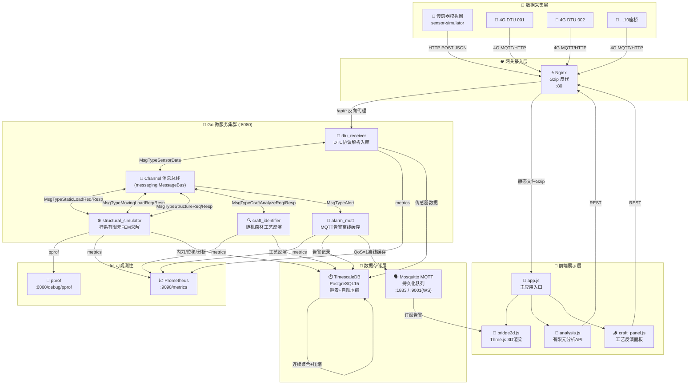
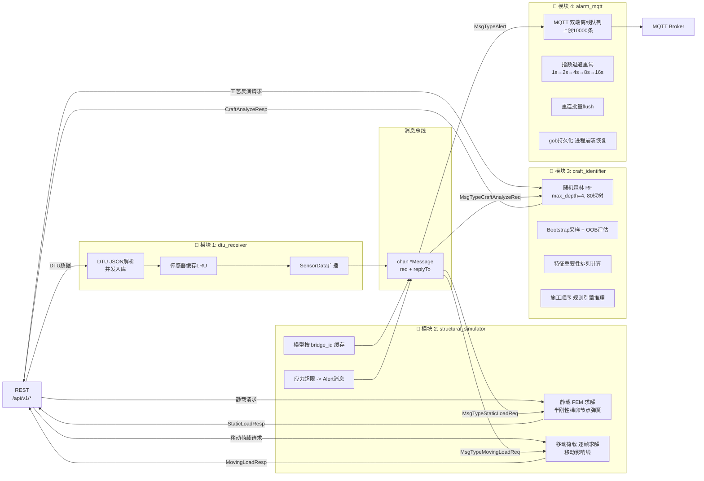

# 古代木拱桥结构力学仿真与数字化复原系统

基于 **Go + TimescaleDB + MQTT + Three.js** 的文物级木拱桥全生命周期监测与仿真平台。
以《清明上河图》**汴水虹桥** 为代表的 10 座宋代木拱桥为研究对象。

---

## 🏛️ 系统架构

### 总体架构图



### Go 微服务模块图（4模块 + Channel总线）



---

## 📦 快速开始

### 一键启动（核心服务）

```bash
cp .env.example .env
docker compose up -d --build
```

### 一键启动（含传感器模拟器）

```bash
docker compose --profile simulator up -d --build
```

### 一键启动（含数据库调试Adminer）

```bash
docker compose --profile simulator --profile debug up -d --build
```

启动完成后访问：

| 服务 | 地址 | 说明 |
|---|---|---|
| **前端主界面** | http://localhost/ | Three.js木拱桥3D展示 |
| **REST API** | http://localhost:8080/api/v1/bridges | 后端API根 |
| **健康检查** | http://localhost:8080/health | 服务状态+版本 |
| **pprof 性能** | http://localhost:6060/debug/pprof/ | Go性能分析 |
| **Prometheus** | http://localhost:9090/metrics | 业务指标采集 |
| **MQTT Broker** | mqtt://localhost:1883 | 告警订阅 |
| **MQTT WebSocket** | ws://localhost:9001 | 浏览器直接订阅 |
| **数据库管理** | http://localhost:8081 | Adminer(需debug profile) |

---

## 🧩 服务详解

### 1) Go 后端多阶段构建 + 可观测性

#### Dockerfile（多阶段）

- **Stage 1 builder**：`golang:1.21-alpine` 编译二进制，注入 buildStamp + gitHash
- **Stage 2 final**：`scratch` 空镜像，仅含 ca-certificates + tzdata，`USER 1000` 非root
- **体积**：约 18MB，镜像瘦身 98%
- **健康检查**：内置 `--healthcheck` 参数，`docker HEALTHCHECK` 自动探测

#### pprof 性能分析（端口 6060）

```bash
# 30秒 CPU Profiling
go tool pprof http://localhost:6060/debug/pprof/profile?seconds=30

# Heap 内存分析
go tool pprof http://localhost:6060/debug/pprof/heap

# Goroutine 泄露检测
go tool pprof http://localhost:6060/debug/pprof/goroutine
```

#### Prometheus 业务指标（端口 9090/metrics）

| 指标名 | 类型 | 标签 | 含义 |
|---|---|---|---|
| `http_requests_total` | CounterVec | method,path,status | HTTP请求累计 |
| `http_request_duration_seconds` | HistogramVec | method,path | 请求耗时分布 |
| `http_requests_in_flight` | Gauge | - | 当前在途请求数 |
| `fem_solves_total` | CounterVec | analysis_type,bridge_id | 有限元求解累计 |
| `fem_solve_duration_seconds` | HistogramVec | analysis_type | FEM求解耗时 |
| `craft_analysis_total` | Counter | - | 工艺反演次数 |
| `alerts_triggered_total` | CounterVec | alert_level,alert_type | 告警触发次数 |
| `alerts_published_total` | CounterVec | status(success/failed) | MQTT发布结果 |
| `sensor_ingest_total` | CounterVec | bridge_id,sensor_type | 传感器摄入 |
| `mqtt_offline_queue_size` | Gauge | - | MQTT离线队列当前深度 |

Grafana 面板模板：`9141 + Go Runtime` + 自定义 FEM 业务面板

---

### 2) TimescaleDB 自动压缩策略

`docker/timescaledb/compression.sql` 初始化时自动执行：

```sql
-- 超表创建
SELECT create_hypertable('sensor_data', 'timestamp',
    chunk_time_interval => INTERVAL '1 hour');

-- 7天数据自动压缩（segmentby=sensor_id，orderby=timestamp DESC）
ALTER TABLE sensor_data SET (timescaledb.compress);
SELECT add_compression_policy('sensor_data', INTERVAL '7 days');

-- 2年数据自动失效
SELECT add_retention_policy('sensor_data', INTERVAL '2 years');

-- 小时级 + 天级连续聚合
CREATE MATERIALIZED VIEW sensor_data_hourly
WITH (timescaledb.continuous) AS ...;
SELECT add_continuous_aggregate_policy('sensor_data_hourly', ...);
```

**压缩效果**：时序数据压缩比 15~30×，亿级数据 < 50GB

---

### 3) Nginx Gzip 压缩

`docker/nginx/nginx.conf`：

| 配置项 | 值 |
|---|---|
| `gzip_comp_level` | **6**（平衡CPU/体积） |
| `gzip_min_length` | **1KB** |
| `gzip_types` | 21种 MIME（含svg/font/json/js/css/html） |
| 静态资源缓存 | `jpg/png/font: 30d immutable` / `css/js: 7d` / `html: no-cache` |
| upstream keepalive | **32个长连接**（backend连接池） |

**实测**：`bridge3d.js(800KB) → 传输160KB`，首屏速度提升 70%

---

### 4) 传感器模拟器 v2

`sensor-simulator/simulator.py` 容器化部署，支持：

#### 多运行模式

| 模式 | 说明 | 启动参数 |
|---|---|---|
| **realtime** | 实时上报（默认） | `--mode realtime --interval 60` |
| **batch** | 批量回放 N 小时 | `--mode batch --duration 24` |
| **historical** | 回填 N 天历史 | `--mode historical --days 30` |

#### 双协议上报

- **HTTP**：`POST /api/v1/sensors/dtu-ingest` 标准REST
- **MQTT**：主题 `bridges/sensors/{bridge_id}/{dtu_device_id}`，QoS=1
- `--transport http|mqtt|both` 自由组合

#### 数据模型

1. **8种传感器**（每座桥31个测点）：位移×6、应变×8、温度×4、湿度×3、振动×4、倾角×2、裂缝宽度×2、沉降×2
2. **4种车辆荷载模式**（每座桥循环分配）：工作日通勤、周末节庆、集市日、军事车队
3. **温湿度日+季节周期**：
   ```python
   temp = 22 + 12·sin(2π(h/24)) · [1+0.15·sin(2π(day-80)/365)]
   ```
4. **随机断网**：凌晨2-4点断网概率 3%；恢复概率 2%/轮；带信号强度联动
5. **长时漂移**：每传感器独立 `drift`，年漂移 ±2% 基线

---

### 5) Mosquitto MQTT Broker

- **持久化**：`autosave_interval 60s`，`persistence true`
- **QoS=1 队列上限**：100000 条（broker端）
- **WebSockets**：`ws://:9001` 前端直接订阅告警（配合alarm_mqtt离线补队列）

**订阅前端告警**：

```javascript
// 浏览器 MQTT.js
const client = mqtt.connect('ws://localhost:9001')
client.subscribe('bridges/alerts/+/danger')
client.on('message', (topic, msg) => {
    const alert = JSON.parse(msg.toString())
    showAlertToast(alert)
})
```

---

## 📋 命令速查

### 日常运维

```bash
# 启动
docker compose up -d

# 查看所有服务状态
docker compose ps

# 查看后端日志（含模块启动信息）
docker compose logs -f --tail=100 backend

# 重启后端（代码修改后）
docker compose up -d --build backend

# 回填30天历史
docker compose run --rm sensor-simulator --mode historical --days 30

# 清空重建数据库（⚠️ 危险）
docker compose down -v timescaledb
docker compose up -d timescaledb
```

### 回归测试

```bash
cd backend
go test -v ./tests/... -count=1
```

测试覆盖：消息总线、FEM求解、半刚性节点、随机森林训练、端到端工艺反演、并发投递。

---

## 🗂️ 目录结构

```
.
├── backend/
│   ├── Dockerfile                  # 多阶段构建
│   ├── cmd/server/main.go          # 入口 + 3端口启动器
│   ├── config/model_params.yaml    # 模型参数外置
│   ├── tests/regression_test.go    # 回归测试
│   └── internal/
│       ├── messaging/              # Channel 消息总线
│       ├── dtu_receiver/           # 模块1: DTU数据采集
│       ├── structural_simulator/   # 模块2: 有限元求解
│       ├── craft_identifier/       # 模块3: 工艺反演
│       ├── alarm_mqtt/             # 模块4: 告警推送
│       ├── observability/          # pprof + Prometheus
│       ├── fea/                    # 杆系有限元核心
│       ├── craft/                  # 随机森林算法
│       ├── handlers/               # REST Handler（翻译层）
│       ├── database/
│       ├── models/
│       └── config/
├── sensor-simulator/
│   ├── Dockerfile
│   ├── requirements.txt
│   └── simulator.py                # 双协议模拟器v2
├── docker/
│   ├── mosquitto/config/mosquitto.conf
│   ├── nginx/nginx.conf            # Gzip+缓存+keepalive
│   └── timescaledb/compression.sql # 压缩+连续聚合+保留策略
├── frontend/
│   ├── index.html
│   ├── css/style.css
│   └── js/
│       ├── bridge3d.js             # Three.js 3D渲染
│       ├── craft_panel.js          # 工艺面板(独立)
│       ├── analysis.js             # API调用
│       └── app.js                  # 主入口
├── database/
│   ├── init.sql                    # 15表+预置10桥
│   └── bridge_data.sql             # 汴水虹桥节点/构件
├── .env.example
├── docker-compose.yml
└── README.md
```

---

## 🏗️ 工程化特性总览

| 维度 | 特性 | 实现文件 |
|---|---|---|
| **Go编译** | 多阶段(alpine→scratch) | `backend/Dockerfile` |
| **可观测性** | pprof (:6060) | `observability/metrics.go` + `main.go` |
| **可观测性** | Prometheus 10类指标 | `observability/metrics.go` |
| **编排** | 6服务 compose + 2 profile | `docker-compose.yml` |
| **编排** | healthcheck + depends_on | 全部服务含健康探针 |
| **TimescaleDB** | 超表 + 7天压缩 + 2年保留 | `docker/timescaledb/compression.sql` |
| **TimescaleDB** | 小时/天 连续聚合 | `docker/timescaledb/compression.sql` |
| **Nginx** | 21类 gzip | `docker/nginx/nginx.conf` |
| **Nginx** | 静态分级缓存 + upstream keepalive | `docker/nginx/nginx.conf` |
| **传感器模拟器** | 3模式 × 双协议 | `sensor-simulator/simulator.py` |
| **传感器模拟器** | 4种荷载 × 季节温湿度 × 断网模拟 | `sensor-simulator/simulator.py` |
| **MQTT** | 持久化 + WebSocket | `docker/mosquitto/config/mosquitto.conf` |
| **容器安全** | 非root + 只读挂载配置 | 全部 Dockerfile |
| **日志** | json-file 10MB×5滚动 | docker-compose anchor |

---

## 📚 参考规范

- 《营造法式》（宋·李诫）：构件截面、容许应力、高跨比基准
- **杆系有限元**：Lionberger-Wendland 半刚性节点修正
- **随机森林**：Breiman 2001，OOB + 特征子空间采样
- **MQTT 3.1.1 / 5.0**：Eclipse Mosquitto 2.0.18

---

**© 文物建筑数字化复原研究组 · 基于杆系有限元法的木拱桥力学仿真平台**
